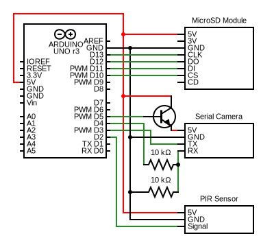
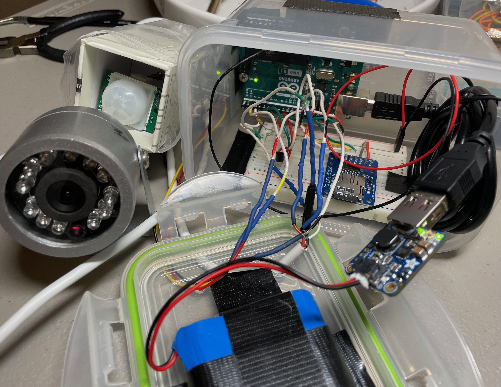

# Trail Cam

This project is a very simple trail camera built with Arduino. It uses a Passive Infrared (PIR) sensor to detect motion. It uses a TTL Serial Camera to take a picture when motion is detected. It saves the resulting image on an SD card. It minimizes power use by (unless motion is detected) putting the Arduino into power-down-sleep and removing power from the camera.

## Schematic

The camera's serial data pins take 3.3V maximum. This explains the two resistors, which make a voltage divider bringing the Arduino's TX from 5V down to 2.5V.

The schematic doesn't show the power supply. I used a 3.7V lithium ion battery pack connected to an Adafruit PowerBoost 1000. You can see this and more in the below picture (in its unpacked state):

## Code

The main Arduino sketch is in TrailCam/. The SdCardOverSerial/ and SdClean/ folders contain helper-sketches to manage the SD Card, which are helpful if one does not have a separate SD card reader.

## Components Used

* 10k ohm resistor (x2)
* 3.7V 6600mAh lithium ion battery pack with JST PH connector
* Adafruit MicroSD card breakout board+
* Adafruit PowerBoost 1000 Basic
* Adafruit TTL Serial JPEG Camerae
* Arduino Uno Rev 3 (+ USB cable)
* NPN Transistor
* PIR sensor
* Plastic enclosures
* SD Card
* Wire
* Screws and tape (to mount the Arduino, breadboard, battery)

## Acknowledgements

This work is mostly a mix of the following.
* https://learn.adafruit.com/ttl-serial-camera/arduino-usage (example sketches coming with camera)
* https://github.com/patrickmoffitt/Adafruit-Feather-M0-Motion-Camera
* https://www.instructables.com/Arduino-Wildlife-Night-Camera/
